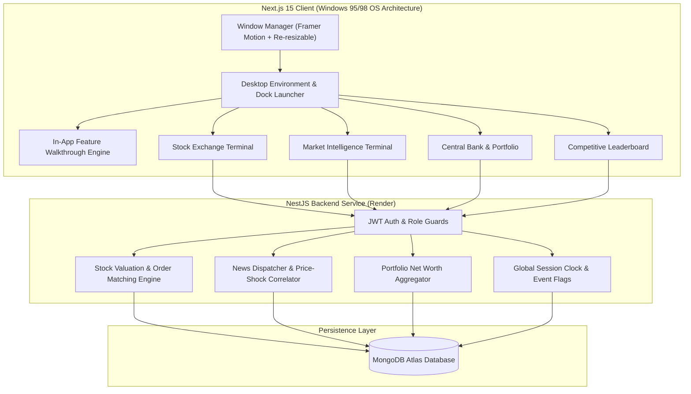

# Goldmann's Gambit — Real-Time Financial Trading Simulator (INGENIUM 2026)

[](https://nextjs.org/)
[](https://nestjs.org/)
[](https://www.mongodb.com/)
[](https://tailwindcss.com/)
[](LICENSE)

An institutional-grade, simulated financial trading exchange built with a retro desktop operating system interface. Designed to test real-time economic decision-making, news-driven market volatility, and liquidity management under high-pressure competitive conditions.

---

## Live Interactive Demo

| Attribute | Details |
| :--- | :--- |
| **Live Production URL** | [https://goldmansgambit.vercel.app](https://goldmansgambit.vercel.app) |
| **Backend API Gateway** | `https://ingenium-category-2-0.onrender.com` |
| **Sample Demo Username** | `demo` |
| **Sample Demo Password** | `demo123` |
| **Starting Liquid Balance**| `$250,000.00` |

> An automated in-app feature walkthrough launches immediately upon sign-in to guide visitors through each terminal program.

---

## Architectural Highlights



---

## Core System Modules

### 1. Stock Exchange Terminal
* Real-time order execution for 17 equities across banking, commodities, logistics, and tech sectors.
* Dynamic bid-ask pricing with historical valuation tracking and intraday percentage change calculations.
* Immediate validation of cash reserves and liquid holdings prior to order confirmation.

### 2. Market Intelligence Terminal
* Structured economic wire service delivering breaking news items.
* Correlated price effects: every dispatched headline applies deterministic or stochastic valuation shocks across specific listed assets.

### 3. Central Bank & Portfolio Manager
* Live liquid capital tracking, deposit account monitoring, and margin calculations.
* Comprehensive asset ledger showing quantity held, average cost basis, and total unrealized gains/losses.

### 4. Competitive Leaderboard
* Real-time global ranking table calculating cumulative net worth across all market participants:
  $$\text{Net Worth} = \text{Liquid Cash} + \sum (\text{Shares Held} \times \text{Current Stock Price})$$

### 5. Multi-Window Desktop Workspace
* Custom window management engine powered by `framer-motion` and `re-resizable`.
* Support for dragging, cascading, resizing, maximizing, and stacking independent program windows.

### 6. Interactive Feature Walkthrough
* Minimalist, step-by-step guidance system highlighting core terminals.
* Zero configuration needed; can be launched or dismissed at any time.

---

## Technology Stack

- **Frontend Framework**: Next.js 15 (React 19, TypeScript)
- **Styling & Animation**: Tailwind CSS v4, Framer Motion, Radix UI primitives
- **Data Visualization**: Recharts (price trends and stock histories)
- **Backend Architecture**: NestJS (Modular architecture, TypeScript)
- **Database & ODM**: MongoDB with Mongoose
- **Authentication**: JWT (JSON Web Tokens) with Passport strategy
- **Deployment**: Vercel (Edge CDN Frontend) + Render (Containerized Node.js Backend)

---

## Local Setup & Development

### Prerequisites
- Node.js 20+
- npm or bun

### 1. Clone Repository
```bash
git clone https://github.com/ayaanthelegend/ingenium-category-2.0.git
cd ingenium-category-2.0
```

### 2. Install Dependencies
```bash
npm install
npm install --prefix Den-WOWS-Backend
npm install --prefix Den-WOWS-Frontend
```

### 3. Configure Environment Variables
* **Backend** (`Den-WOWS-Backend/.env`):
  ```env
  PORT=3000
  MONGO_URI=mongodb://localhost:27017/nest-auth
  ADMIN_KEY=change_this_to_a_secure_admin_key
  JWT_SECRET=change_this_to_a_secure_jwt_secret
  ```
  *(Note: If a local MongoDB instance is not detected on port 27017, the NestJS backend automatically starts an in-memory MongoDB database.)*

* **Frontend** (`Den-WOWS-Frontend/.env.local`):
  ```env
  NEXT_PUBLIC_API_URL=http://localhost:3000
  ```

### 4. Run Development Servers
```bash
# Concurrently start backend and frontend:
npm run dev

# Or run separately:
npm run dev:backend   # Port 3000
npm run dev:frontend  # Port 3001
```

---

## License
Licensed under the [GNU General Public License v3.0](LICENSE).
