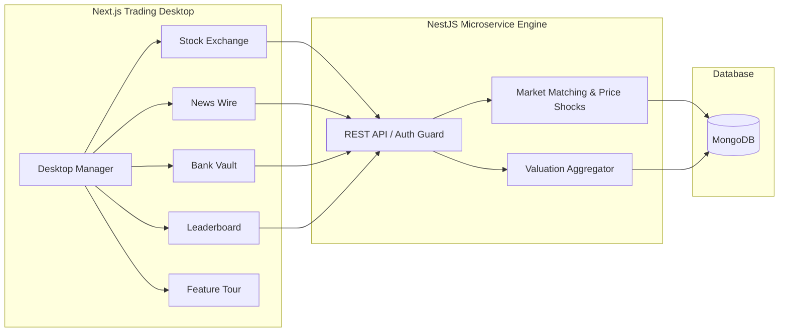

# Markhors Den — Wolves of Wall Street Trading Simulation

[](https://nextjs.org/)
[](https://nestjs.org/)
[](https://www.mongodb.com/)
[](https://tailwindcss.com/)
[](LICENSE)

An interactive stock trading competition platform engineered for high-intensity finance simulations. Features real-time stock execution, breaking news volatility shocks, central bank liquidity operations, and live participant rankings inside an immersive desktop windowing environment.

---

## Live Interactive Demo

| Attribute | Details |
| :--- | :--- |
| **Live Production URL** | [https://markhors-den.vercel.app](https://markhors-den.vercel.app) |
| **Backend API Gateway** | `https://ingenium-category-2-0.onrender.com` |
| **Sample Demo Username** | `demo` |
| **Sample Demo Password** | `demo123` |
| **Starting Liquid Balance**| `$250,000.00` |

> A minimalist in-app feature walkthrough launches upon sign-in to explain each terminal module step by step.

---

## System Architecture



---

## Key Functional Highlights

- **Dynamic Stock Desk**: Instant buy/sell order placement across 17 companies with real-time portfolio rebalancing.
- **Breaking News Engine**: Market-moving headlines that apply immediate valuation shifts to targeted equities.
- **Central Banking & Net Worth Calculation**: Comprehensive liquidity management with total asset tracking:
  $$\text{Net Worth} = \text{Cash} + \sum (\text{Quantity} \times \text{Price})$$
- **Live Leaderboard**: Real-time ranking of competing teams based on mark-to-market valuations.
- **Desktop Window Manager**: Draggable, resizable, stackable window frames replicating an authentic operating system workspace.
- **In-App Guided Tour**: Step-by-step feature onboarding explaining every operational component.

---

## Tech Stack

- **Client**: Next.js 15, React 19, TypeScript, Tailwind CSS v4, Framer Motion, Recharts
- **API Engine**: NestJS 10, Passport JWT, Mongoose ODM
- **Database**: MongoDB (Production Atlas / In-Memory fallback for local development)
- **Hosting**: Vercel (Edge Frontend) & Render (Backend Service)

---

## Quickstart

```bash
# Clone
git clone https://github.com/ayaanthelegend/markhors-den.git
cd markhors-den

# Install dependencies
npm install
npm install --prefix Den-WOWS-Backend
npm install --prefix Den-WOWS-Frontend

# Run locally
npm run dev
```

---

## License
Licensed under the [GNU General Public License v3.0](LICENSE).
